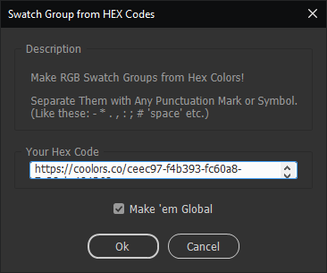
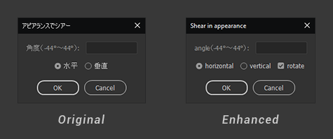

# Scripts for Illustrator

Welcome to my personal collection of useful Illustrator scripts.

Function over form - that's probably the best way to describe them, meaning my code might not be the best looking, or most logical approach, but It-Works™.

 

## Swatch Group from Hexadecimal colors
Make Illustrator swatches from a series of HEX codes
There's a version with a Dialog window where you can paste in your hex codes and a "quick" version that takes the text from the clipboard.
Works great with [Coolors](https://coolors.co/) links, CSS code from [Adobe Color](https://color.adobe.com/explore) or any other text containing HEX codes.

 📝 [addSwatchGroup](./all%20them%20Scripts/addSwatchGroup.jsx) - with Dialog Window

 📝 [quickAddSwatchGroup](./all%20them%20Scripts/quickAddSwatchGroup.jsx) - without Dialog
 
 

## Gradient from Hex colors
Make Illustrator Gradient swatch from a series of HEX codes.  
Create a gradient with the [generator](https://www.learnui.design/tools/gradient-generator.html), copy the CSS code and run the script.

 📝 [quickAddGradient](./all%20them%20Scripts/quickAddGradient.jsx)

 

## Shear and Rotate
Found this gem on the [internet](http://sysys.blog.shinobi.jp/Entry/53/), a script to create non-destructive Shear using Transform Effects.
Most of the time I also rotate the objects at the shear angle, so added a checkbox for that, and translated the script to english.
Select the objects you want to shear and run the script.

 📝 [shearNrotate](./all%20them%20Scripts/shearNrotate.jsx)

 
 
 
 
 
 
 
 

### License
These scripts were originally made for my personal use, but thought someone might find them useful.

Some of these scripts were written by me, some of them written by other humans on the internet - and labeled accordingly.

Use them, share them, enjoy them. They are FREE. Free as in Free Beer - use them responsibly.

Oh, and don't be a PooHead and try to sell them.
